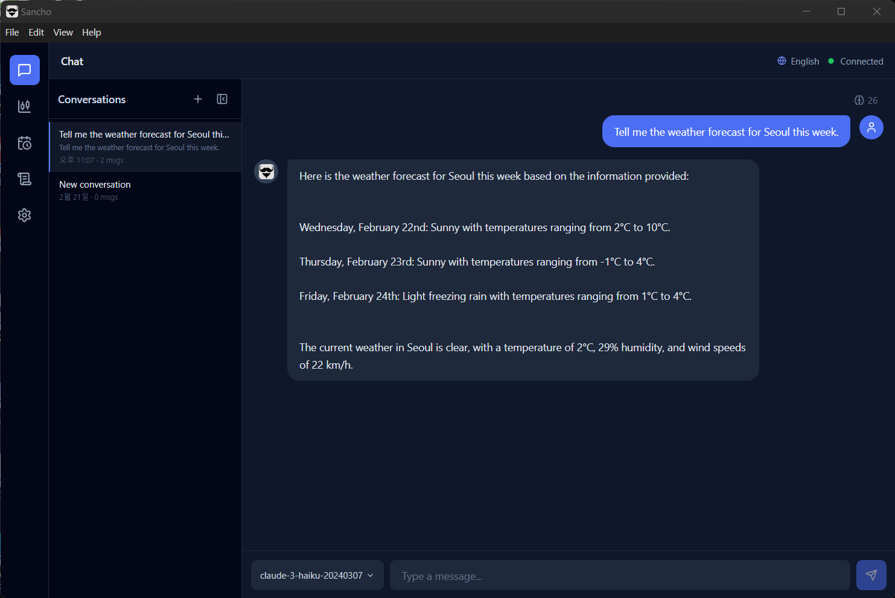
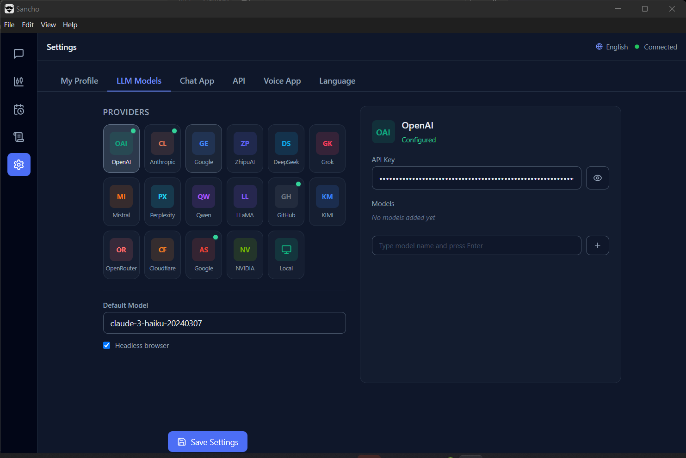
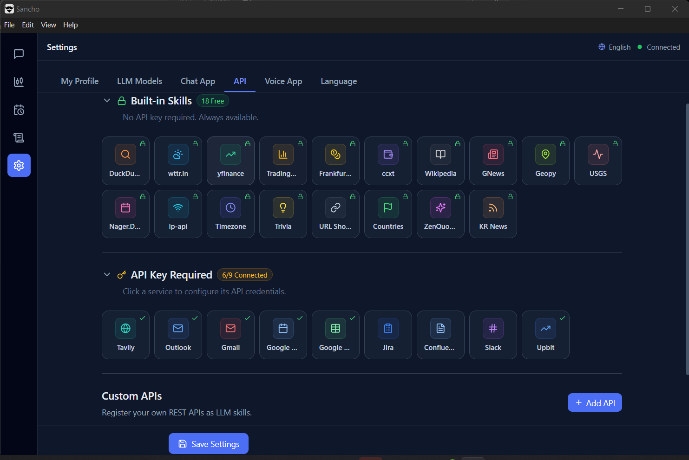
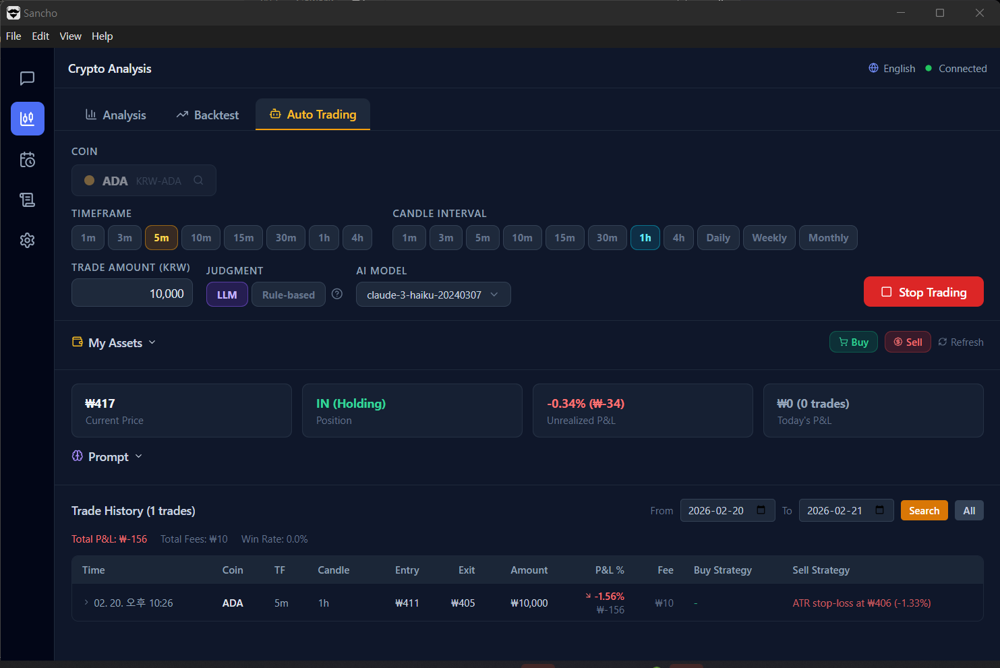
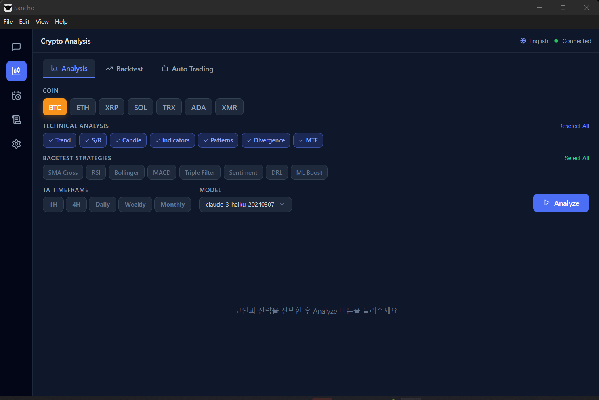
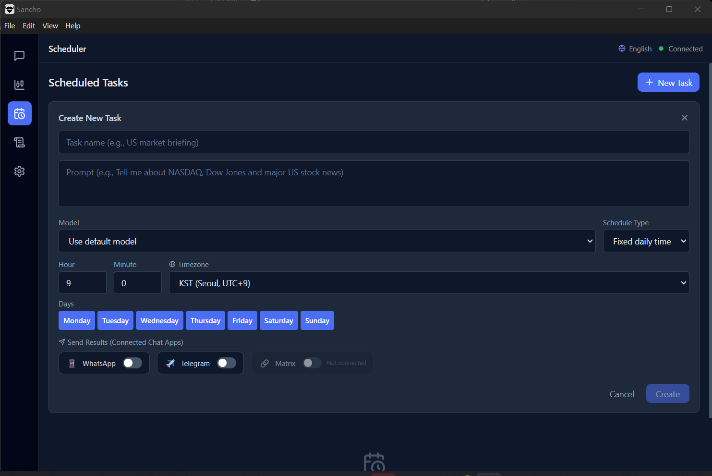
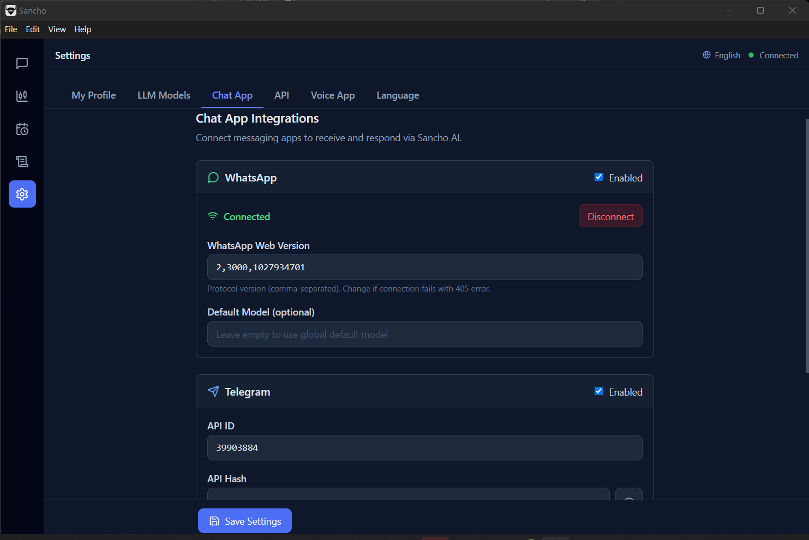
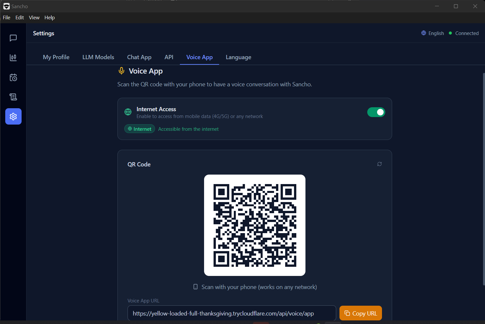
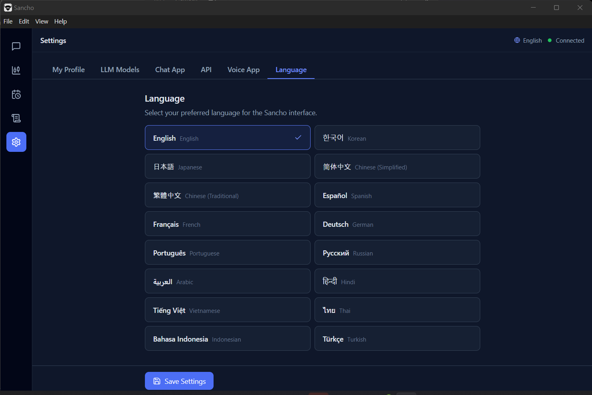

<p align="center">
  
</p>

<h1 align="center">Sancho</h1>

<p align="center">
  <b>Your Personal AI Agent for Windows</b><br>
  Chat with 14 LLMs &bull; Automate Browser Tasks &bull; Manage Files &bull; Trade Crypto<br>
  Connect WhatsApp, Telegram, Slack &bull; Send Emails &bull; Voice Chat from Your Phone
</p>

<p align="center">
  <a href="https://github.com/jihan972025/Sancho/releases/latest"></a>
  <a href="https://github.com/jihan972025/Sancho/releases/latest"></a>
  <a href="https://github.com/jihan972025/Sancho/blob/main/LICENSE"></a>
  
</p>

<p align="center">
  <a href="#-quick-start">Quick Start</a> &bull;
  <a href="#-features">Features</a> &bull;
  <a href="#-skills">Skills</a> &bull;
  <a href="#-setup-guides">Setup Guides</a> &bull;
  <a href="#-architecture">Architecture</a>
</p>

---

## What is Sancho?

Sancho is a **local AI agent desktop app** that runs entirely on your Windows PC. It connects to 14+ LLM providers and gives you a unified interface to chat, automate tasks, manage files, trade crypto, and control your browser — all through natural language.

**Talk to it from anywhere** — connect your WhatsApp, Telegram, Slack, or phone (voice) and interact with your AI agent on the go.

> **Windows Only** — Sancho is designed and built exclusively for Windows 10/11.

---

## Screenshots

<p align="center">
  
</p>
<p align="center"><i>Chat with AI via WhatsApp, Telegram, Slack, or directly in the app</i></p>

<details>
<summary><b>More Screenshots</b></summary>

<p align="center">
  
</p>
<p align="center"><i>17 LLM Providers — switch between models freely</i></p>

<p align="center">
  
</p>
<p align="center"><i>30 Built-in Skills + Custom API Registration</i></p>

<p align="center">
  
</p>
<p align="center"><i>Crypto Auto-Trading with LLM or Rule-based Strategies</i></p>

<p align="center">
  
</p>
<p align="center"><i>Technical Analysis — RSI, MACD, Bollinger Bands, Moving Averages</i></p>

<p align="center">
  
</p>
<p align="center"><i>Task Scheduler — Automate recurring tasks with messenger notifications</i></p>

<p align="center">
  
</p>
<p align="center"><i>Messenger Integration — WhatsApp, Telegram, Slack, Matrix</i></p>

<p align="center">
  
</p>
<p align="center"><i>Voice Chat — Scan QR to talk from your phone (Wi-Fi or Internet)</i></p>

<p align="center">
  
</p>
<p align="center"><i>16 Languages — English, Korean, Japanese, Chinese, Spanish, and more</i></p>

</details>

---

## Quick Start

### 1. Download & Install
Download the latest installer — all dependencies are bundled. No separate setup required.

<p align="center">
  <a href="https://github.com/jihan972025/Sancho/releases/latest">
    
  </a>
</p>

### 2. Add an API Key
Go to **Settings > API** and enter at least one LLM API key (e.g., OpenAI, Anthropic, Google Gemini).

### 3. Start Chatting
Type a message or connect a messenger to interact with Sancho from your phone.

---

## Features

### Multi-LLM Chat
Switch between **14 LLM providers** freely in a single conversation:

| Provider | Provider | Provider |
|----------|----------|----------|
| OpenAI | Anthropic | Google Gemini |
| DeepSeek | Grok (xAI) | Mistral |
| Perplexity | Qwen (Alibaba) | ZhipuAI |
| Llama (Together AI) | GitHub Models | KIMI (Moonshot) |
| NVIDIA NIM | Local LLM (Ollama / LM Studio) | |

- Real-time SSE streaming responses
- **Conversation memory** — remembers facts, preferences, and context across all sessions
- **AI Persona** — customize name, personality traits, tone, speaking style, and behavior
- **Conversation summaries** — past conversations are automatically summarized and referenced

### AI Persona & Memory
Give your AI a unique identity and let it remember everything:

- **Persona customization** — set a custom name, personality traits (tags), tone, speaking style, greeting, and special behavioral instructions
- **Preset personas** — one-click presets: Friendly Assistant, Professional Consultant, Casual Buddy
- **Long-term memory** — automatically extracts and remembers facts, preferences, relationships, events, and context from every conversation (6 categories, importance scoring 1-5)
- **Conversation summaries** — when you start a new conversation, the previous one is summarized and stored. Recent summaries are injected into every new chat for continuity
- **Relevance-based recall** — high-importance memories and keyword-matched memories are prioritized in the system prompt

### Messenger Integration
Connect your favorite chat apps and talk to Sancho from your phone.
All messengers share the same **AI persona, long-term memory, and conversation context** as the desktop app.

| Messenger | Connection |
|-----------|------------|
| **WhatsApp** | QR code scan (auto WA Web version detection) |
| **Telegram** | API key + QR code |
| **Slack** | Bot Token + App Token (Socket Mode) |
| **Matrix / Element X** | Password or Access Token |

### Email & Calendar
| Service | Capabilities |
|---------|-------------|
| **Gmail** | Search, read, send emails |
| **Outlook** | Search, read, send emails (Microsoft Graph API) |
| **Google Calendar** | Create, search, list, delete events |
| **Google Tasks** | Create, list, complete, delete to-do items |
| **Google Sheets** | Read and write spreadsheet data |

### Browser Automation
- **@playwright/cli** based — text snapshots with ref-based actions (no screenshots needed)
- Snapshot → LLM → Action loop (up to 20 steps)
- 48 actions: click, fill, type, drag, select, hover, scroll, tabs, cookies, and more

### File Manager
- Browse, create, move, and delete files with natural language
- AI-powered automatic file organization
- Protected directory safeguards

### Voice Chat
- Scan a QR code to open voice chat on your phone
- Speech-to-text input + text-to-speech responses
- **Wi-Fi mode** (local network) or **Internet mode** (Cloudflare Tunnel)

### Crypto Trading
- **Real-time prices** from Binance (BTC, ETH, XRP, SOL, and more)
- **Technical analysis** — RSI, MACD, Bollinger Bands, Moving Averages (1h to Monthly)
- **Auto-trading on Upbit** — LLM-based or rule-based strategies with stop-loss and daily loss limits
- **Natural language trading** — "Buy 100,000 KRW of Bitcoin" or "Check my balance"

### Task Scheduler
- Schedule recurring tasks with cron-like intervals
- Results delivered via connected messengers

---

## Skills

**31 built-in skills** — 21 free, 10 with API key integration, plus custom API support.

<details>
<summary><b>Free Skills (No API Key Required)</b></summary>

| # | Skill | Description |
|---|-------|-------------|
| 1 | **duckduckgo** | Web search and news |
| 2 | **wttr** | Real-time weather forecasts |
| 3 | **yfinance** | Stock prices and market data (Yahoo Finance) |
| 4 | **tradingview** | Technical analysis — RSI, MACD, Bollinger Bands, MAs |
| 5 | **frankfurter** | Foreign exchange rates (30+ currencies) |
| 6 | **ccxt** | Real-time crypto prices from Binance |
| 7 | **wikipedia** | Wikipedia article search and summaries |
| 8 | **gnews** | Google News search (141 countries, 41 languages) |
| 9 | **geopy** | Geocoding — address to coordinates and reverse |
| 10 | **usgs** | Real-time earthquake data (USGS) |
| 11 | **nagerdate** | Public holidays for 100+ countries |
| 12 | **ipapi** | IP address geolocation |
| 13 | **timezone** | Timezone and local time lookup |
| 14 | **trivia** | Trivia quiz (24 categories) |
| 15 | **pyshorteners** | URL shortening (TinyURL) |
| 16 | **restcountries** | Country details — capital, population, languages |
| 17 | **zenquotes** | Random inspirational quotes |
| 18 | **filesystem** | File read, write, organize, move, delete |
| 19 | **info** | Combined country, holiday, timezone, geocode, IP |
| 20 | **fun** | Combined trivia, quotes, URL shortener |
| 21 | **krnews** | Korean news headlines (Yonhap, SBS, Donga, etc.) |

</details>

<details>
<summary><b>API Key Required</b></summary>

| # | Skill | Description |
|---|-------|-------------|
| 1 | **tavily** | AI-optimized web search |
| 2 | **outlook** | Microsoft Outlook email (Azure AD OAuth) |
| 3 | **gmail** | Gmail email (Google OAuth 2.0) |
| 4 | **google_calendar** | Google Calendar management |
| 5 | **google_tasks** | Google Tasks to-do list management |
| 6 | **google_sheets** | Google Sheets read/write |
| 7 | **jira** | Atlassian Jira project management |
| 8 | **confluence** | Atlassian Confluence documentation |
| 9 | **slack** | Slack workspace messaging |
| 10 | **upbit** | Crypto auto-trading on Upbit |

</details>

<details>
<summary><b>Custom API</b></summary>

- Register any REST API as an LLM skill from **Settings > API**
- **Skill Chaining**: Automatically execute multiple skills in sequence (e.g., search → save to file)

</details>

---

## Use Cases

| What you say | What Sancho does |
|:-------------|:-----------------|
| "Check my unread Gmail" | Searches and summarizes unread emails |
| "Send an email to boss@company.com about the meeting" | Composes and sends via Gmail or Outlook |
| "What's the weather this week?" | Fetches 7-day forecast via wttr.in |
| "Buy 50,000 KRW of Ethereum" | Executes trade on Upbit |
| "Organize my Downloads folder" | Sorts files by type into subfolders |
| "Search for flights to Tokyo on Google" | Opens browser, navigates, and extracts results |
| "Add a meeting tomorrow at 3pm" | Creates Google Calendar event |
| "Add to my tasks: submit report by Friday" | Creates a Google Tasks to-do item with due date |
| "Analyze Bitcoin on the daily chart" | Returns RSI, MACD, Bollinger, MA signals |
| "Remember that I prefer short answers" | Saves preference and applies to all future conversations |
| "What did we discuss yesterday?" | Uses conversation summaries to recall recent topics |

---

## Setup Guides

| Guide | Description |
|-------|-------------|
| [WhatsApp Setup](docs/whatsapp-setup.md) | Connect WhatsApp via QR code |
| [Telegram Setup](docs/telegram-setup.md) | Get API keys and connect Telegram |
| [Element X Setup](docs/elementx-setup.md) | Connect Matrix / Element X |
| [Slack Setup](docs/slack-setup.md) | Connect Slack bot via Socket Mode |
| [Gmail Setup](docs/gmail-setup.md) | Connect Gmail via Google OAuth 2.0 |
| [Outlook Setup](docs/outlook-setup.md) | Connect Outlook via Azure AD OAuth 2.0 |
| [Google Calendar Setup](docs/google-calendar-setup.md) | Connect Google Calendar via OAuth 2.0 |
| [Google Tasks Setup](docs/google-calendar-setup.md) | Google Tasks uses the same Google OAuth 2.0 login |
| [Google Sheets Setup](docs/google-sheets-setup.md) | Connect Google Sheets via OAuth 2.0 |
| [GitHub LLM Models](docs/github-llm-setup.md) | Use free LLM models via GitHub |

---

## Architecture

```
Electron + React (Vite + Tailwind CSS)     <- Desktop UI
        | REST API + SSE
Python FastAPI Backend (port 8765)         <- Subprocess managed by Electron
  |-- 14 LLM Providers
  |-- AI Persona (persona.json) & Memory System
  |     |-- Long-term Memory (6 categories, importance scoring)
  |     |-- Conversation Summarizer (auto-summary on switch)
  |     +-- Relevance-based Prompt Assembly
  |-- Skill System (31 built-in + custom API)
  |-- File Agent
  |-- Browser Agent (@playwright/cli)
  |-- Email (Gmail + Outlook via Graph API)
  |-- Calendar, Tasks & Sheets (Google APIs)
  |-- Messenger Bots (WhatsApp, Telegram, Slack, Matrix)
  |-- Auto-Trading Engine (Upbit)
  |-- Voice App (Cloudflare Tunnel)
  |-- Task Scheduler (APScheduler)
  +-- Security Middleware (Rate Limit, Tunnel Guard, CORS)
```

## Tech Stack

| Layer | Technology |
|-------|-----------|
| Desktop | Electron |
| Frontend | React, TypeScript, Vite, Tailwind CSS |
| State | Zustand |
| Backend | Python, FastAPI |
| Browser | @playwright/cli |
| Messenger | Baileys (WhatsApp), GramJS (Telegram), Slack Bolt, matrix-js-sdk |
| Email | Microsoft Graph API (Outlook), Gmail API |
| Voice | Cloudflare Tunnel, Web Speech API |
| Build | PyInstaller, electron-builder (NSIS) |

## Security

- **Tunnel Guard**: Endpoint whitelist, request size limit (1 MB), path traversal prevention
- **Rate Limiting**: Sliding-window (30 req/60s per IP) for tunnel requests
- **CORS Lockdown**: Explicit origin whitelist
- **Web Security**: Always enabled in Electron (no dev-mode bypass in production)
- **Encryption**: API keys and OAuth tokens encrypted at rest in `config.json`
- **File Safety**: Symlink resolution, `.sancho` directory protection
- **Input Validation**: Message count, length, role, and model validation

---

## License

MIT
